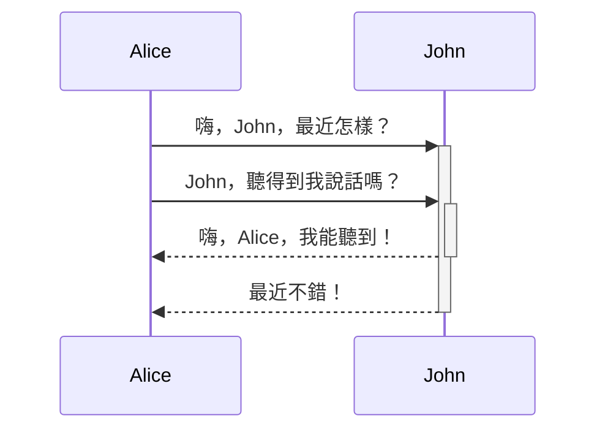

Obsidian 是一個基於 Markdown 進行記錄的知識庫軟體。

目前 Obsidian 支援的格式如下：

---

### 內部鏈接

通過`[[]]`來鏈接庫中任意一個檔案。

```md
鏈接一篇筆記：[[內部鏈接]]。
```

鏈接一篇筆記：[[內部鏈接]]。

---

### 嵌入檔案

在筆記中插入其他檔案（更多細節請閱讀[[嵌入檔案]]）。這裡將演示如何插入一篇筆記的某個章節：

```md
![[Obsidian#什麼是 Obsidian]]
```

![[Obsidian#什麼是 Obsidian]]

---

### 小標題

```md
# 這是小標題 1
## 這是小標題 2
### 這是小標題 3 
#### 這是小標題 4
##### 這是小標題 5
###### 這是小標題 6
```

# 這是小標題 1
## 這是小標題 2
### 這是小標題 3 
#### 這是小標題 4
##### 這是小標題 5
###### 這是小標題 6

---

### 強調

```md
*這是斜體示例*
_這是斜體的另一種寫法_
```

*這是斜體示例*
_這是斜體的另一種寫法_

```md
**這是粗體示例**
__這是粗體的另一種寫法__
```

**這是粗體示例**
__這是粗體的另一種寫法__

```md
_你也**可以**將它們配合使用_
```

_你也**可以**將它們配合使用_

---

### 列表

```md
- 專案 1
- 專案 2
	- 專案 2a
	- 專案 2b

1. 專案 1
1. 專案 2
1. 專案 3
   1. 專案 3a
   1. 專案 3b
```

無序列表：
- 專案 1
- 專案 2
	- 專案 2a
	- 專案 2b

有序列表：
1. 專案 1
1. 專案 2
1. 專案 3
	1. 專案 3a
	2. 專案 3b

--- 

### 圖片

```md

```


#### 調整圖片大小

比如，將上面的示例圖片調整為100畫素寬：

```md

```


---

### 其他鏈接

#### 外部鏈接

Markdown 風格的鏈接既可以用來指向網頁這類外部對象，也可以用來指向庫中的筆記或者圖片。

```md
http://obsidian.md - automatic!
[Obsidian](http://obsidian.md)
```

http://obsidian.md - 自動化!
[Obsidian](http://obsidian.md)

#### Obsidian URI

[[使用 obsidian URI|Obsidian URI]] 可以讓你在其他應用或 Obsidian 的其他庫中打開目前庫的某篇筆記。

比如，你可以通過以下方式跳轉到某個庫中的某篇筆記（請注意 [[使用 obsidian URI#編碼|URI 的編碼]]）：

```md
[打開某篇筆記](obsidian://open?path=D:%2Fpath%2Fto%2Ffile.md)
```

[打開某篇筆記](obsidian://open?path=D:%2Fpath%2Fto%2Ffile.md)

除了通過筆記的地址來鏈接筆記外，你也可以通過筆記所在的庫名稱以及筆記名稱來鏈接該筆記：

```md
[打開某篇筆記](obsidian://open?vault=MainVault&file=MyNote.md)
```

[打開某篇筆記](obsidian://open?vault=MainVault&file=MyNote.md)

#### 轉義

如果 url 中含有空格的話，空格需要轉義為 `%20`，如：

```md
[Export options](Pasted%20image)
```

[Export options](Pasted%20image)

當然，你也可以用 `<>` 將空格包含起來，如：

```md
[Slides Demo](<Slides Demo>)
```

[Slides Demo](<Slides Demo>)

---

### 引用

```md
> Human beings face ever more complex and urgent problems, and their effectiveness in dealing with these problems is a matter that is critical to the stability and continued progress of society.

\- Doug Engelbart, 1961
```

> Human beings face ever more complex and urgent problems, and their effectiveness in dealing with these problems is a matter that is critical to the stability and continued progress of society.

\- Doug Engelbart, 1961

---

### 行內程式碼

```md
一行中被 `反引號` 括起來的文字會以程式碼格式顯示。
```

一行中被 `反引號` 括起來的文字會以程式碼格式顯示。

---

### 程式碼塊

Obsidian 會將六個反引號括起來的內容識別為程式碼塊，並將其按程式碼格式顯示。程式碼塊支援語法高亮功能，你可以在程式碼塊的第一行（即開頭處的反引號后）聲明語言來使用特定的語法高亮。

程式碼塊的語法高亮實際是使用 prismjs 來實現的，因此你可以到[他們的網站](https://prismjs.com/#supported-languages) 來檢視其支援的語言。

<pre><code>```js
function fancyAlert(arg) {
  if(arg) {
    $.facebox({div:'#foo'})
  }
}
```</code></pre>

```js
function fancyAlert(arg) {
  if(arg) {
    $.facebox({div:'#foo'})
  }
}
```

```md
    如果你使用 Tab 鍵對段落進行縮排，這段文字在預覽模式下也會被識別為程式碼塊。
```

	
	如果你使用 Tab 鍵對段落進行縮排，這段文字在預覽模式下也會被識別為程式碼塊。
	
---

### 任務列表

```md
- [x] 支援 #標籤 ，[鏈接]()，**樣式**
- [x] 要求包含列表標誌（有序表無序表均可，比如 `1.[x]` 同樣可以）
- [x] 這是一個已經完成的專案
- [?] 這也是一個已完成的專案（實際上你可以在其中使用任何字元）
- [ ] 這是一個未完成的專案
- [ ] 在預覽模式下單擊選框可以切換專案完成狀態
```

- [x] 支援 #標籤 ，[鏈接]()，**樣式**
- [x] 要求包含列表標誌（有序表無序表均可，比如 `1.[x]` 同樣可以）
- [x] 這是一個已經完成的專案
- [?] 這也是一個已完成的專案（實際上你可以在其中使用任何字元）
- [ ] 這是一個未完成的專案 
- [ ] 在預覽模式下單擊選框可以切換專案完成狀態

---

### 表格

你可以使用 `-` 來分割表格的標題行和內容行，使用 `|` 來指定不同的列：

```md
| 標題1          | 標題2          |
| -------------- | -------------- |
| 單元格11的內容 | 單元格12的內容 |
| 單元格21的內容 | 單元格22的內容 |
```

| 標題1          | 標題2          |
| -------------- | -------------- |
| 單元格11的內容 | 單元格12的內容 |
| 單元格21的內容 | 單元格22的內容 |

---

| 列寬可以通過冒號來進行調整 | 這樣你就可以在標題行中輸入長標題 |
| :------------------------- | -------------------------------: |
| 因為 `:` 的存在            |             不同列將有不同的列寬 |

你可以在表格中新增鏈接，因為鏈接能在表格中正確顯示。但如果你的鏈接中包含 `|`，則需要對其進行轉義（用 `\|` 代替 `|`），以防止鏈接中的豎線被錯誤識別為列分隔符。

如果你在列表中新增鏈接，他們可以正常的顯示與使用。但如果使用的是豎線鏈接，則需要在豎線前面加上 `\` 來進行轉義，防止表格錯亂。

```md
| 標題1                      | 標題2              |
| -------------------------- | ------------------ |
| [[格式化你的筆記\|格式化]] | [[快捷鍵\|快捷鍵]] |
```

| 標題1                      | 標題2              |
| -------------------------- | ------------------ |
| [[格式化筆記\|格式化]] | [[使用快捷鍵\|快捷鍵]] |

---

### 刪除線

```md
在文字兩端加上波浪線將會顯示為刪除效果，比如~~這樣~~。
```

在文字兩端加上波浪線將會顯示為刪除效果，比如~~這樣~~。

---

###  高亮

```md
使用兩個等號來對文字進行高亮==文字==。
```

使用兩個等號來對文字進行高亮==文字==。

---

### 腳註

```md
H腳註的用法很簡單，只需要在段落中需要插入腳註的地方標註一個符號，再在段落後對這個符號進行解釋即可。比如這是一個簡單的腳註，[^1] 這是一個長一些的腳註。[^長腳註]

[^1]: 很有用！
[^長腳註]: 這是一個可以寫長段落或者程式碼的地方。
	
	你可以使用縮排在腳註中納入其他段落。
	
	`{ 程式碼 }`

	這樣你就可以在腳註中新增任意數量的段落了。
```

腳註的用法很簡單，只需要在段落中需要插入腳註的地方標註一個符號，再在段落後對這個符號進行解釋即可。比如這是一個簡單的腳註，[^1] 這是一個長一些的腳註。[^長腳註]

[^1]: 很有用！
[^長腳註]: 這是一個可以寫長段落或者程式碼的地方。
	
	你可以使用縮排在腳註中納入其他段落。
	
	`{ 程式碼 }`

	這樣你就可以在腳註中新增任意數量的段落了。
	
你也可以使用行內腳註。^[請注意符號^需要在方括號外]

### 數學公式

```md
$$\begin{vmatrix}a & b\\
c & d
\end{vmatrix}=ad-bc$$
```

$$\begin{vmatrix}a & b\\
c & d
\end{vmatrix}=ad-bc$$

你也可以像這樣 $e^{2i\pi} = 1$ 使用行內公式。

這裡的公式使用的是 LaTeX 語法，你可以到相應網站了解更多相關資訊。

### 註釋

所謂註釋，指的是會在編輯模式中顯示，但不會在預覽模式中顯示的內容。使用 `%%` 可以將內容變為註釋。以下為語法：

```md
這裡是行內註釋：%%預覽模式下你將看不到這句話%%

這裡是跨行註釋：
%%
所謂跨行
就是可以有很多行
%%
```

以下為示例：

這裡是行內註釋：%%預覽模式下你將看不到這句話%%

這裡是跨行註釋：
%%
所謂跨行
就是可以有很多行
%%

### 圖表

Obsidian 通過 [Mermaid](https://mermaid-js.github.io/) 及其所提供的[編譯器](https://mermaid-js.github.io/mermaid-live-editor)來為使用者提供圖表的繪製功能。

<pre><code>```mermaid
sequenceDiagram
    Alice->>+John: 嗨，John，最近怎樣？
    Alice->>+John: John，聽得到我說話嗎？
    John-->>-Alice: 嗨，Alice，我能聽到！
    John-->>-Alice: 最近不錯！
```</code></pre>



## 開發小記

總的來說，我們在努力讓 Obsidian 的語法不偏離正統的 Markdown 語法太多。總的來看，Obsidian 的語法大多還是基於 CommonMark，包括了一些 GitHub Flavored Markdown（GFM）和 LaTeX，以及我們特有的嵌入檔案語法。